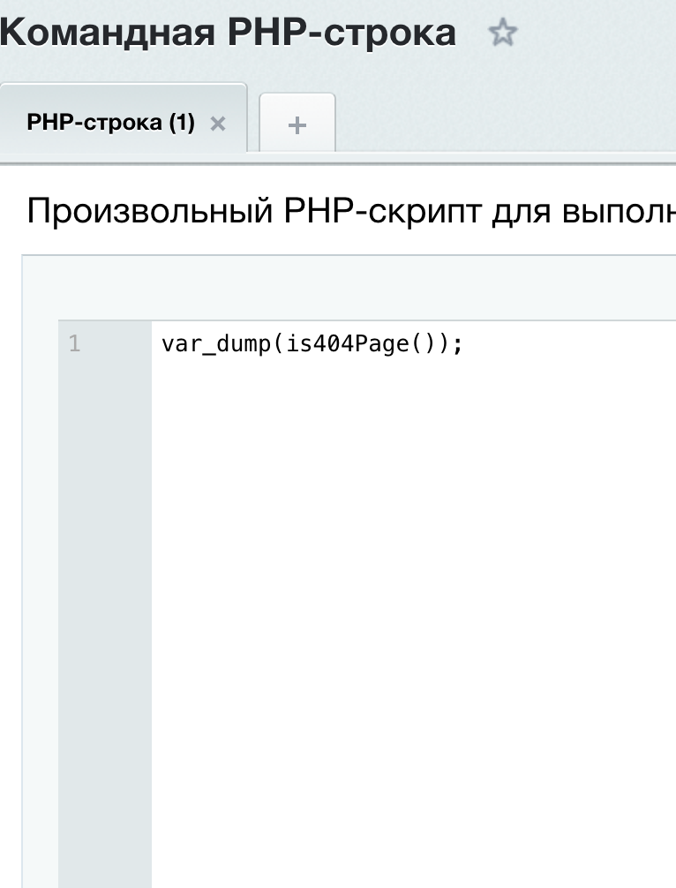

# Структура полной сборки

1. /install/index.php – основной файл инсталлятора/деинсталлятора (содержит логику установки, удаления, обновления модуля).

2. /install/version.php – файл с версией модуля (обязателен, версия должна быть больше нуля).

3. /include.php – главный подключаемый файл модуля (здесь подключаются все необходимые классы, функции, объявляются константы).

# Подключение модуля

```
<?php

\Bitrix\Main\Loader::includeModule('mycompany.custom');
```
если подлючить так local/php_interface/init.php то модуль будет доступен на любой странице где подключён init.php


# Структура репозитория

- mycompany.custom - пример начального объявления модуля
- mycompany".custom - пример начального с функционалом объявления модуля
  ### Функционал mycompany2.custom
  - mycompany2.custom/lib/eventhandlers/main.php - функция redirectFromTestPage() редерект на главную елси чел зашёл на страницу test без роли админ

Подключение функции redirectFromTestPage() (local/modules/mycompany.custom/lib/eventhandlers/main.php)

```

$eventManager->addEventHandler('main', 'OnProlog', [
    'MyCompany\Custom\EventHandlers\Main',
    'redirectFromTestPage'
]);

```

- mycompany2.custom/functions.php - функция is404Page() сообщает находетлись вы на странице 404

Пример:


