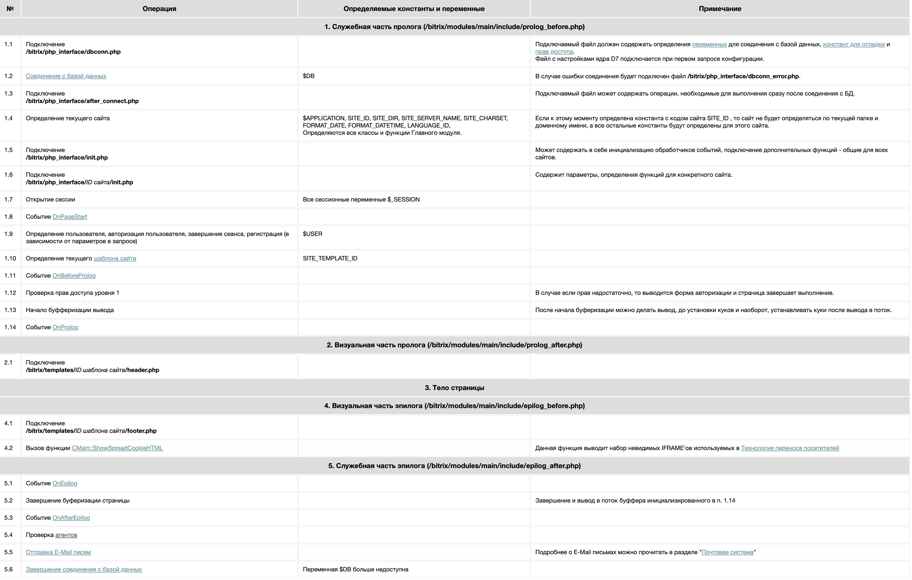

# Технические навыки

## Базовые элементы Bitrix Framework для решения задач кастомизации

* Собственные модули для организации кода в рамках проекта
Структура полной сборки
/install/index.php – основной файл инсталлятора/деинсталлятора (содержит логику установки, удаления, обновления модуля).

/install/version.php – файл с версией модуля (обязателен, версия должна быть больше нуля).

/include.php – главный подключаемый файл модуля (здесь подключаются все необходимые классы, функции, объявляются константы).


* Страница и порядок её выполнения. Использование обработчиков событий из порядка выполнения страницы. Решение задач с учетом доступности объектов и буферизации контента на различных этапах выполнения страницы.



local/templates/ex2_type4/components/bitrix/catalog/.default/bitrix/catalog.section/furniture/**result_modifier.php**
```php
$count = count($arResult['filtredRev']);
$arResult['count'] = $count;
$this->__component->SetResultCacheKeys(['count']);
```

local/templates/ex2_type4/components/bitrix/catalog/.default/bitrix/catalog.section/furniture/**component_epilog.php**
```php
<?
if(!defined("B_PROLOG_INCLUDED") || B_PROLOG_INCLUDED!==true)die();

$meta = $APPLICATION->GetProperty("ex2_meta");
if (str_contains($meta, '#count#')) {
    $meta = str_replace("#count#", $arResult['count'], $meta);
}

$APPLICATION->SetPageProperty('ex2_meta', $meta);
```


## Расширение возможностей типовых компонентов
* Использование parameters.php, result_modifier.php, component_epilog.php для расширения возможностей типовых компонентов.
